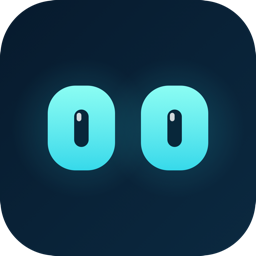
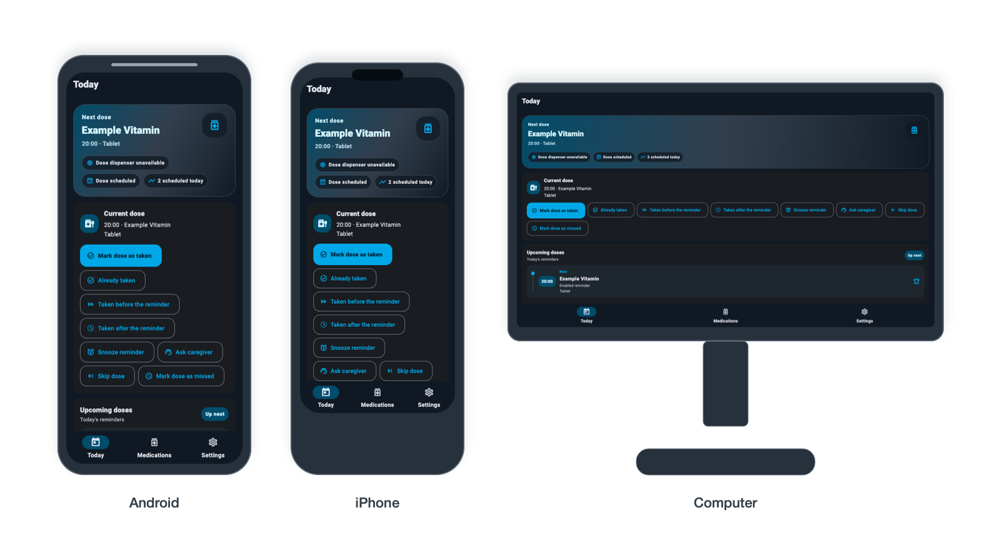

# Dosey

<p align="center">
  
</p>

[](#project-status)
[](https://flutter.dev/)
[](LICENSE)

Dosey is an open-source medication-dispensing companion robot prototype that helps organize scheduled doses and reminders. It is not medical-grade and is not a medical device.

<a id="safety"></a>

## Safety first

Use fake pills, candy, beads, dry beans, or vitamins only while testing this prototype. Follow prescription instructions; Dosey does not provide medical advice and must not be used to decide whether to take an extra dose.

Controller movement does not mean a dose was delivered, visible, correct, or Taken. If the app recognizes a missed-dose warning, it records only that the warning was seen; it does not change the dose state or supply.

> This dose was missed. Follow your prescription instructions or ask your caregiver, pharmacist, or doctor.

Stop a physical test when there is a jam, unexpected movement, reset, disconnect, heat, or power fault. Dosey is not a medical device, and its physical hardware still needs qualification.

## How Dosey is meant to work

Dosey keeps a schedule on the phone and can present reminders through its app. The premade Daviky carousel has one compartment for each scheduled dose; Dosey does not count individual pills.

When a dose is due, the app can record a request to move the carousel, ask whether the expected dose is visible and correct, and then ask for an explicit **Taken** confirmation. These are separate steps. Supply changes only after an explicit Taken confirmation, never because the controller moved or because a missed-dose warning was acknowledged.

The app keeps local dose history and supply information. It can run as an optional mounted Android Robot Mode or as Personal Mode on Android and the web.

## What you can try locally

The local software foundations support use without cloud medication sync:

- Add local medications, schedules, and inventory details, then review dose actions in Today.
- Open Robot Face on an Android Robot build.
- Run Guided Trial with deterministic fake data, including simulated movement, missed-dose, and offline scenarios.
- Export and restore local backups from Settings.
- Use in-app Help and visit the [repository](https://github.com/SloppyBobbert/Dosey) or [issues](https://github.com/SloppyBobbert/Dosey/issues).
- Keep medication, schedules, dose history, inventory, and related data on the device in Drift/SQLite.



The computer view is a responsive presentation preview, not a shipped or qualified Personal Today app. Android is the mounted Robot target; use the web app on iOS, iPadOS, and computers.

## Modes and platforms

| Experience | Platform | Current note |
| --- | --- | --- |
| Personal Mode | Android native; web on iOS, iPadOS, and computers | Native iOS source is frozen historical source and is unsupported. iOS cannot be the phone mounted in the robot. |
| Robot Mode | Android only | Intended for the phone mounted in Dosey; it provides Robot Face and app-owned, soft navigation guardrails. |
| Appwrite pairing and caregiver features | Backend foundation | Legacy create/claim staging deployments remain active. Secure mounted-access and medication-sync staging/deployment are incomplete and inactive; medication data is not cloud-synced. |

Native Android distribution is through an Android app store or GitHub downloads
when a release is available. The web app is the supported route on iOS, iPadOS,
and computers.

## Project status

Dosey has local foundations for medication and schedule management, dose actions, Robot Face, Guided Trial, backup and restore, a controller simulator, and local-first storage. These foundations do not yet constitute a qualified Android release, dependable background reminder service, or integrated physical dispenser.

Provisioning, production reminder and missed-dose-service integration, inventory integration across all dose flows, secure mounted-access and medication-sync staging and production deployment, and caregiver features remain incomplete. The ESP32-C6 controller, Bluetooth lifecycle, servo power path, repeatable one-slot carousel movement, and integrated phone-to-hardware behavior also require direct physical testing. Until that evidence exists, this repository is an experimental software and hardware prototype.

### Roadmap

1. Qualify the local Android software experience on a real phone.
2. Test the controller and Daviky carousel with fake media, including faults and repeated one-slot movement.
3. Revisit the secure mounted-access and caregiver rollout only after mounted mobile compatibility, legacy-device inventory, a controlled staging rollout, and two-device validation.

## Explore or contribute

Start with the app, its documentation, or an open issue. Contributions that improve clarity, local safety behavior, testing, and reproducible hardware evidence are especially useful.

- Read the [app guide](mobile_app/dosey_app/README.md) for local setup and current app scope.
- See [README media](tool/readme_media/README.md) to verify or intentionally refresh the Today captures and device showcase.
- Read the [protocol](docs/protocol.md), [controller bench runbook](docs/controller_bench_runbook.md), and [hardware validation record](firmware/HARDWARE_VALIDATION.md) before working with hardware.
- Review [open issues](https://github.com/SloppyBobbert/Dosey/issues) or browse the [repository](https://github.com/SloppyBobbert/Dosey).
- See the [local backup format](docs/local_backup_format.md) and [Robot software demo qualification record](mobile_app/dosey_app/ROBOT_SOFTWARE_DEMO_QUALIFICATION.md) for current evidence and limits.

## Repository map

```text
Dosey/
├── backend/appwrite/       # Server-side identity, ownership, and pairing foundations
├── firmware/               # XIAO bring-up programs and safe controller baseline
├── mobile_app/dosey_app/   # Flutter application
├── mechanical/             # Daviky carousel, servo, LEGO shell, and assembly notes
├── docs/                   # Protocols, test runbooks, and backup documentation
└── media/                  # Hardware media and rendered README showcase assets
```

## Technical details

### Architecture boundaries

The phone owns medication data, schedules, dose history, supply, user interface, reminders, and caregiver logic. Drift/SQLite is the authoritative local store for that information.

The Seeed Studio XIAO ESP32-C6 controller is hardware-only. It handles actions and reports from the servo, sensors, indicators, buttons, Bluetooth, and controller status. A controller success event is not proof of delivery, visibility, correctness, or Taken status.

The hardware plan uses a premade Daviky carousel, a Grove Base for XIAO, and a servo pusher. Never power motors from the phone or directly from XIAO pins; use a suitable motor power path with shared ground. Read the [mechanical and hardware notes](mechanical/README.md) before changing the physical build.

### Appwrite boundary

Appwrite contains identity, ownership or membership, pairing, and medication-sync foundations. Flutter calls Functions and does not read pairing or sync tables directly. Local medication data is not generally cloud-synced. Legacy create/claim staging deployments remain active. Secure mounted-access and medication-sync staging/deployment are incomplete and inactive; do not activate or replace the legacy deployments. Secure mounted access requires mounted mobile compatibility, legacy-device inventory, a controlled staging rollout, and two-device validation. Appwrite outages must not block the local Robot shell.

Medication schedules, dose state and history, inventory, and related medication data remain local. The Appwrite medication-sync contract, Functions, schema template, and terminal-persistence adapters are foundations only; they do not activate medication sync or complete terminal-outcome persistence.

<a id="mobile-app"></a>

### Development commands

Run these from `mobile_app/dosey_app/`. Use the validated public JSON profile wrapper; never put server secrets in a client profile.

```sh
flutter pub get
dart format .
dart run build_runner build
git diff --exit-code -- lib/core/storage/dosey_database.g.dart
flutter analyze
flutter test
dart run tool/appwrite_profile.dart flutter --profile config/appwrite/offline.json --flavor personal -- run
dart run tool/appwrite_profile.dart flutter --profile config/appwrite/offline.json --flavor robot -- run
dart run tool/appwrite_profile.dart flutter --profile config/appwrite/offline.json --flavor personal -- build apk --debug
dart run tool/appwrite_profile.dart flutter --profile config/appwrite/offline.json --flavor robot -- build apk --debug
git diff --check
```

For firmware, run the safe-default controller build from `firmware/`. The command below uses a machine-specific PlatformIO path; see [`firmware/README.md`](firmware/README.md) for setup and the command for your environment:

```sh
/tmp/dosey-platformio/bin/pio run -e controller_baseline
```

Read [`firmware/README.md`](firmware/README.md) for setup, tests, upload commands, and physical safety gates.

### Verification limits

Mobile CI checks formatting, analysis, tests, generated Drift code, and Android debug builds. It does not qualify a release, background reminders, physical behavior, or production readiness. The committed controller firmware starts with external hardware paths disabled by default; see the [protocol](docs/protocol.md) for its current safe-default behavior and tested boundaries.

## License

Dosey is licensed under the [GNU General Public License v3.0](LICENSE).
